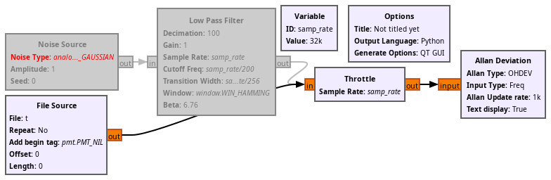
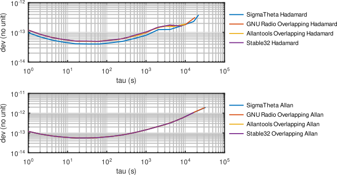

Convert the provided ASCII file to binary to be read by GNU Radio:
```bash
cat noisetest.ykt  | grep -v ^% | cut -c29-51 | tr "\n" " " | ascii2binary -tf > t
```



SigmaTheta (https://sourcesup.renater.fr/www/sigmatheta/):
```bash
SigmaTheta/st_HDev  noisetest.ykt
1.0000e+01           9.7192338891476231e-14
2.0000e+01           7.0200326399012672e-14
4.0000e+01           5.4946090361401224e-14
8.0000e+01           4.6492431836961538e-14
1.6000e+02           4.1408194519883464e-14
3.2000e+02           4.0569979900392851e-14
6.4000e+02           4.0454156809602422e-14
1.2800e+03           4.4587033208778665e-14
2.5600e+03           4.9939149332156973e-14
5.1200e+03           6.2405019804353278e-14
1.0240e+04           8.0464306738148294e-14
2.0480e+04           1.2328424810004359e-13
4.0960e+04           1.2510608933752278e-13
8.1920e+04           1.6792917123492498e-13
1.6384e+05           2.3209905160068632e-13
2.1845e+05           3.8438523879653863e-13
```

SigmaTheta (https://sourcesup.renater.fr/www/sigmatheta/):
```bash
st_ADev < noisetest.ykt
1.000e+01 1.20e-13
2.000e+01 8.83e-14
4.000e+01 7.06e-14
8.000e+01 6.10e-14
1.600e+02 5.61e-14
3.200e+02 5.59e-14
6.400e+02 5.86e-14
1.280e+03 6.64e-14
2.560e+03 7.98e-14
5.120e+03 1.04e-13
1.024e+04 1.45e-13
2.048e+04 2.13e-13
4.096e+04 3.17e-13
8.192e+04 5.54e-13
1.638e+05 1.08e-12
3.277e+05 1.94e-12
```

gr-allan (AllanTools):
```bash
OHDEV:
1.0000e+00 1.18996682e-13
2.0000e+00 8.59503177e-14 
3.0000e+00 7.40883304e-14 
6.0000e+00 6.03147972e-14
1.0000e+01 5.46704807e-14 
1.8000e+01 5.01389577e-14 
3.2000e+01 4.97468180e-14 
5.6000e+01 4.91063852e-14
1.0000e+02 5.35037460e-14 
1.7800e+02 5.64182173e-14 
3.1600e+02 6.52400250e-14 
5.6200e+02 7.79720509e-14
1.0000e+03 9.67922828e-14 
1.7780e+03 1.40373223e-13 
3.1620e+03 1.62296228e-13 
5.6230e+03 1.64226353e-13
1.0000e+04 1.81061493e-13 
1.7783e+04 3.20856472e-13 
```

gr-allan (AllanTools):
```bash
TDEV:
[1.0000e+00 2.0000e+00 3.0000e+00 6.0000e+00 1.0000e+01 1.8000e+01
 3.2000e+01 5.6000e+01 1.0000e+02 1.7800e+02 3.1600e+02 5.6200e+02
 1.0000e+03 1.7780e+03 3.1620e+03 5.6230e+03 1.0000e+04 1.7783e+04
 3.1623e+04]
[6.91274182e-14 8.64326172e-14 1.04377307e-13 1.75818000e-13
 2.69842806e-13 4.70971414e-13 8.53542784e-13 1.57132493e-12
 3.12871483e-12 6.39667482e-12 1.39643473e-11 3.16336178e-11
 7.64363025e-11 1.86544206e-10 4.62524451e-10 1.27890594e-09
 3.86390202e-09 1.21299483e-08 0.00000000e+00]
```

gr-allan (AllanTools):
```bash
OADEV:
1.0000e+00 1.19732200e-13 
2.0000e+00 8.82685127e-14 
3.0000e+00 7.69037991e-14 
6.0000e+00 6.41516318e-14
1.0000e+01 5.89961523e-14 
1.8000e+01 5.57757880e-14 
3.2000e+01 5.59810673e-14 
5.6000e+01 5.77003454e-14
1.0000e+02 6.35519880e-14 
1.7800e+02 7.14732793e-14 
3.1600e+02 8.61876894e-14 
5.6200e+02 1.08520609e-13
1.0000e+03 1.43863750e-13 
1.7780e+03 1.98233584e-13 
3.1620e+03 2.69054917e-13 
5.6230e+03 4.07819253e-13
1.0000e+04 6.62793641e-13 
1.7783e+04 1.17414295e-12 
3.1623e+04 1.91546297e-12
```

Using the ``validate.py`` script:
```bash
OHDEV:
1.000e+00 1.19035819e-13
2.000e+00 8.59774897e-14
4.000e+00 6.72949424e-14
7.000e+00 5.84305586e-14
1.400e+01 5.16412911e-14
2.700e+01 4.96994319e-14
5.200e+01 4.89178009e-14
1.000e+02 5.33899630e-14
1.930e+02 5.71030681e-14
3.730e+02 6.91222740e-14
7.200e+02 8.33167277e-14
1.389e+03 1.20661183e-13
2.683e+03 1.60942443e-13
5.179e+03 1.56397675e-13
1.000e+04 1.91181420e-13
```

and again using the ``validate.py`` script:
```bash
OADEV:
1.000e+00 1.19773265e-13
2.000e+00 8.82901716e-14
4.000e+00 7.05986858e-14
7.000e+00 6.23564106e-14
1.400e+01 5.66960536e-14 
2.700e+01 5.57033864e-14 
5.200e+01 5.71895939e-14 
1.000e+02 6.34256883e-14
1.930e+02 7.29376626e-14 
3.730e+02 9.17167941e-14 
7.200e+02 1.21214237e-13 
1.389e+03 1.72885316e-13
2.683e+03 2.44714087e-13 
5.179e+03 3.79048370e-13 
1.000e+04 6.60268988e-13
```

Comparison of SigmaTheta with this implementation. BE CAREFUL to set the dataset as *frequency*
(and not the default behaviour of phase)


